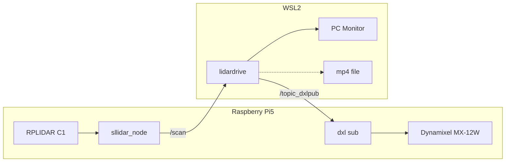

# lidardrive

> RPLIDAR C1 실시간 스캔 데이터를 이용한 장애물 회피 자율주행 ROS2 패키지

---

## 목차

1. [개요](#개요)
2. [시스템 구성](#시스템-구성)
3. [알고리즘 처리 흐름](#알고리즘-처리-흐름)
4. [P제어 속도 공식](#p제어-속도-공식)
5. [주요 파라미터](#주요-파라미터)
6. [시각화 요소](#시각화-요소)
7. [실행 방법](#실행-방법)
8. [소스코드 설명](#소스코드-설명)
9. [실행 결과](#실행-결과)

---
실행결과 영상 : https://youtu.be/Kz9Rsu6-ASI
---

## 개요

RPLIDAR C1의 `/scan` 토픽을 실시간으로 구독하여 전방 장애물을 인식하고,  
P제어 기반으로 Dynamixel MX-12W 모터 속도를 제어하는 자율주행 ROS2 패키지.

| 항목 | 내용 |
|------|------|
| OS | WSL2 Ubuntu 24.04 |
| ROS2 | Jazzy |
| 언어 | C++17 |
| 하드웨어 | RPLIDAR C1, Dynamixel MX-12W, Raspberry Pi5 |
| 구독 토픽 | `/scan` (`sensor_msgs/msg/LaserScan`) |
| 발행 토픽 | `/topic_dxlpub` (`geometry_msgs/msg/Vector3`) |

---

## 시스템 구성

```
[Raspberry Pi5]                          [WSL2]
RPLIDAR C1 → sllidar_node → /scan  →  lidardrive → /topic_dxlpub → dxl sub → Dynamixel
                                                  → PC Monitor (스캔 영상)
                                                  → lidardrive_result.mp4
```



---

## 알고리즘 처리 흐름

```
/scan 토픽 수신
       ↓
① 스캔 영상 생성     극좌표 → 픽셀 좌표 변환 (500×500, 반경 1.5m)
       ↓
② 장애물 마스크 생성  BGR (0,0,200)~(50,50,255) 빨간 픽셀 추출
       ↓
③ 전방 180도 분리    y: 0 ~ CY  (이미지 상단 절반)
       ↓
④ 좌/우 최단거리 검출 dist = dx²+dy²  |  MIN_PIXELS ≥ 20 (노이즈 제거)
       ↓
⑤ 가상 장애물 배치   한쪽만 있을 때 → 없는 쪽 끝에 가상 장애물 배치
       ↓
⑦ error 계산         atan2(mid_x - CX, CY - 125) × 180/π  (단위: degree)
       ↓
⑧ 스무딩             error = prev × 0.9 + raw × 0.1
       ↓
⑨ P제어 속도 계산    L = BASE + KP×error  /  R = -(BASE - KP×error)
       ↓
⑩ /topic_dxlpub 발행  +  mp4 저장
```
<!DOCTYPE html>
<html lang="ko">
<head>
<meta charset="UTF-8">
<title>lidardrive 알고리즘 블럭도</title>
<style>
  body { margin: 0; background: #f8fafc; font-family: sans-serif; }
  svg { display: block; margin: auto; }
</style>
</head>
<body>
<svg width="680" viewBox="0 0 680 980" xmlns="http://www.w3.org/2000/svg">
  <defs>
    <marker id="arrow" viewBox="0 0 10 10" refX="8" refY="5" markerWidth="6" markerHeight="6" orient="auto-start-reverse">
      <path d="M2 1L8 5L2 9" fill="none" stroke="context-stroke" stroke-width="1.5" stroke-linecap="round" stroke-linejoin="round"/>
    </marker>
  </defs>

  <!-- ① /scan 토픽 수신 -->
  <rect x="240" y="30" width="200" height="44" rx="22" fill="#D3D1C7" stroke="#5F5E5A" stroke-width="0.5"/>
  <text x="340" y="52" text-anchor="middle" dominant-baseline="central" font-size="14" font-weight="500" fill="#2C2C2A">/scan 토픽 수신</text>
  <line x1="340" y1="74" x2="340" y2="102" stroke="#5F5E5A" stroke-width="1.5" marker-end="url(#arrow)"/>

  <!-- ② 스캔 영상 생성 -->
  <rect x="190" y="104" width="300" height="56" rx="8" fill="#B5D4F4" stroke="#185FA5" stroke-width="0.5"/>
  <text x="340" y="126" text-anchor="middle" dominant-baseline="central" font-size="14" font-weight="500" fill="#0C447C">스캔 영상 생성</text>
  <text x="340" y="146" text-anchor="middle" dominant-baseline="central" font-size="12" fill="#185FA5">극좌표 → 픽셀 좌표  (500×500, 반경 1.5m)</text>
  <line x1="340" y1="160" x2="340" y2="188" stroke="#185FA5" stroke-width="1.5" marker-end="url(#arrow)"/>

  <!-- ③ 장애물 마스크 -->
  <rect x="190" y="190" width="300" height="56" rx="8" fill="#B5D4F4" stroke="#185FA5" stroke-width="0.5"/>
  <text x="340" y="212" text-anchor="middle" dominant-baseline="central" font-size="14" font-weight="500" fill="#0C447C">장애물 마스크 생성</text>
  <text x="340" y="232" text-anchor="middle" dominant-baseline="central" font-size="12" fill="#185FA5">BGR (0,0,200)~(50,50,255) 빨간 픽셀 추출</text>
  <line x1="340" y1="246" x2="340" y2="274" stroke="#185FA5" stroke-width="1.5" marker-end="url(#arrow)"/>

  <!-- ④ 전방 분리 -->
  <rect x="190" y="276" width="300" height="56" rx="8" fill="#B5D4F4" stroke="#185FA5" stroke-width="0.5"/>
  <text x="340" y="298" text-anchor="middle" dominant-baseline="central" font-size="14" font-weight="500" fill="#0C447C">전방 180도 분리</text>
  <text x="340" y="318" text-anchor="middle" dominant-baseline="central" font-size="12" fill="#185FA5">y: 0 ~ CY  /  좌(x&lt;CX) · 우(x≥CX) 영역 분리</text>
  <line x1="340" y1="332" x2="340" y2="360" stroke="#185FA5" stroke-width="1.5" marker-end="url(#arrow)"/>

  <!-- ⑤ 최단거리 검출 -->
  <rect x="190" y="362" width="300" height="56" rx="8" fill="#9FE1CB" stroke="#0F6E56" stroke-width="0.5"/>
  <text x="340" y="384" text-anchor="middle" dominant-baseline="central" font-size="14" font-weight="500" fill="#085041">좌/우 최단거리 장애물 검출</text>
  <text x="340" y="404" text-anchor="middle" dominant-baseline="central" font-size="12" fill="#0F6E56">dist = dx²+dy²  |  MIN_PIXELS ≥ 20</text>
  <line x1="340" y1="418" x2="340" y2="446" stroke="#0F6E56" stroke-width="1.5" marker-end="url(#arrow)"/>

  <!-- ⑥ 가상 장애물 다이아몬드 -->
  <polygon points="340,448 450,496 340,544 230,496" fill="none" stroke="#888780" stroke-width="0.5"/>
  <text x="340" y="491" text-anchor="middle" dominant-baseline="central" font-size="12" fill="#444441">한쪽만</text>
  <text x="340" y="506" text-anchor="middle" dominant-baseline="central" font-size="12" fill="#444441">장애물?</text>

  <!-- YES 분기 -->
  <line x1="450" y1="496" x2="548" y2="496" stroke="#1D9E75" stroke-width="1.5" marker-end="url(#arrow)"/>
  <text x="495" y="488" text-anchor="middle" font-size="12" fill="#1D9E75">YES</text>
  <rect x="490" y="510" width="160" height="56" rx="8" fill="#9FE1CB" stroke="#0F6E56" stroke-width="0.5"/>
  <text x="570" y="532" text-anchor="middle" dominant-baseline="central" font-size="14" font-weight="500" fill="#085041">가상 장애물 배치</text>
  <text x="570" y="552" text-anchor="middle" dominant-baseline="central" font-size="12" fill="#0F6E56">없는 쪽 끝 x=0 / x=499</text>
  <path d="M570 566 L570 630 L450 630" fill="none" stroke="#1D9E75" stroke-width="1.5" stroke-dasharray="5 3" marker-end="url(#arrow)"/>

  <!-- NO 분기 -->
  <line x1="340" y1="544" x2="340" y2="598" stroke="#888780" stroke-width="1.5" marker-end="url(#arrow)"/>
  <text x="352" y="572" font-size="12" fill="#888780">NO</text>

  <!-- ⑦ error 계산 -->
  <rect x="190" y="600" width="300" height="56" rx="8" fill="#9FE1CB" stroke="#0F6E56" stroke-width="0.5"/>
  <text x="340" y="622" text-anchor="middle" dominant-baseline="central" font-size="14" font-weight="500" fill="#085041">error 각도 계산</text>
  <text x="340" y="642" text-anchor="middle" dominant-baseline="central" font-size="12" fill="#0F6E56">atan2(mid_x-CX, CY-125) × 180/π</text>
  <line x1="340" y1="656" x2="340" y2="684" stroke="#0F6E56" stroke-width="1.5" marker-end="url(#arrow)"/>

  <!-- ⑧ 스무딩 -->
  <rect x="190" y="686" width="300" height="56" rx="8" fill="#9FE1CB" stroke="#0F6E56" stroke-width="0.5"/>
  <text x="340" y="708" text-anchor="middle" dominant-baseline="central" font-size="14" font-weight="500" fill="#085041">스무딩</text>
  <text x="340" y="728" text-anchor="middle" dominant-baseline="central" font-size="12" fill="#0F6E56">error = prev × 0.9 + raw × 0.1</text>
  <line x1="340" y1="742" x2="340" y2="770" stroke="#0F6E56" stroke-width="1.5" marker-end="url(#arrow)"/>

  <!-- ⑨ P제어 -->
  <rect x="190" y="772" width="300" height="56" rx="8" fill="#CECBF6" stroke="#534AB7" stroke-width="0.5"/>
  <text x="340" y="794" text-anchor="middle" dominant-baseline="central" font-size="14" font-weight="500" fill="#3C3489">P제어 속도 계산</text>
  <text x="340" y="814" text-anchor="middle" dominant-baseline="central" font-size="12" fill="#534AB7">L = BASE+KP×err  /  R = -(BASE-KP×err)</text>
  <line x1="340" y1="828" x2="340" y2="856" stroke="#534AB7" stroke-width="1.5" marker-end="url(#arrow)"/>

  <!-- ⑩ 발행 -->
  <rect x="190" y="858" width="300" height="44" rx="22" fill="#D3D1C7" stroke="#5F5E5A" stroke-width="0.5"/>
  <text x="340" y="880" text-anchor="middle" dominant-baseline="central" font-size="14" font-weight="500" fill="#2C2C2A">/topic_dxlpub 발행  +  mp4 저장</text>

  <!-- 왼쪽 단계 레이블 -->
  <text x="172" y="52"  text-anchor="end" font-size="12" fill="#888780">① 수신</text>
  <text x="172" y="135" text-anchor="end" font-size="12" fill="#185FA5">② 영상</text>
  <text x="172" y="223" text-anchor="end" font-size="12" fill="#185FA5">③ 마스크</text>
  <text x="172" y="310" text-anchor="end" font-size="12" fill="#185FA5">④ 전방</text>
  <text x="172" y="393" text-anchor="end" font-size="12" fill="#0F6E56">⑤ 검출</text>
  <text x="172" y="496" text-anchor="end" font-size="12" fill="#888780">⑥ 판단</text>
  <text x="172" y="631" text-anchor="end" font-size="12" fill="#0F6E56">⑦ error</text>
  <text x="172" y="717" text-anchor="end" font-size="12" fill="#0F6E56">⑧ 평활</text>
  <text x="172" y="800" text-anchor="end" font-size="12" fill="#534AB7">⑨ 제어</text>
  <text x="172" y="880" text-anchor="end" font-size="12" fill="#888780">⑩ 출력</text>
</svg>
</body>
</html>
```

### 가상 장애물 배치 (핵심 로직)

한쪽에만 장애물이 있을 때 반대편 끝을 가상 장애물로 처리하여  
항상 양쪽 기준으로 중앙점을 계산한다.

| 상황 | 처리 |
|------|------|
| 좌측만 장애물 | 우측 끝 (x=499) 에 가상 장애물 배치 → 좌측 벽 회피 |
| 우측만 장애물 | 좌측 끝 (x=0) 에 가상 장애물 배치 → 우측 벽 회피 |
| 양쪽 장애물 | 실제 좌우 장애물 중앙점으로 계산 |
| 장애물 없음 | error = 0° 직진 |

### Error 정의 (각도 기반)

| error 값 | 방향 |
|---------|------|
| 0° | 정면 직진 |
| +45° | 우측 45도 방향 |
| -45° | 좌측 45도 방향 |
| +90° | 우측 90도 (최대) |
| -90° | 좌측 90도 (최대) |

---

## P제어 속도 공식

```
좌측휠 속도  =  BASE_SPEED  +  KP × error
우측휠 속도  =  -(BASE_SPEED  -  KP × error)
```

> error > 0 : 장애물 중앙이 우측 → 좌바퀴 빠르게 → 우측으로 이동  
> error < 0 : 장애물 중앙이 좌측 → 우바퀴 빠르게 → 좌측으로 이동  
> error = 0 : 직진

| error | 좌측휠 | 우측휠 | 동작 |
|-------|--------|--------|------|
| 0° | 50 | -50 | 직진 |
| +30° | 130 | -10 | 우측 이동 |
| -30° | 10 | -130 | 좌측 이동 |

---

## 주요 파라미터

| 파라미터 | 값 | 설명 | 조절 방법 |
|---------|-----|------|----------|
| `BASE_SPEED` | 50 | 기본 직진 속도 (rpm) | 낮출수록 안전 |
| `KP` | 1 | P제어 게인 | 클수록 빠른 방향전환, 진동 주의 |
| `WORLD_SIZE` | 3.0m | 라이다 인식 범위 (반경 1.5m) | 넓힐수록 원거리 인식 |
| `MIN_PIXELS` | 20 | 최소 장애물 픽셀 수 | 작을수록 민감, 클수록 노이즈 제거 |

---

## 시각화 요소

| 표시 | 색상 | 의미 |
|------|------|------|
| 점 (2px) | 빨간색 | 라이다 장애물 포인트 |
| 원 (8px) | 초록색 | 좌측 최단거리 장애물 |
| 원 (8px) | 파란색 | 우측 최단거리 장애물 |
| 원 (6px) | 노란색 | 양쪽 장애물 중앙점 |
| 화살표 | 회색 | 나아가야 할 방향 |
| 가로선 | 파란색 | 전방/후방 경계 |
| 세로선 | 초록색 | 좌/우 영역 경계 |

---

## 실행 방법

### 패키지 생성 및 빌드

```bash
cd ~/ros2_ws/src
ros2 pkg create lidardrive --build-type ament_cmake \
    --dependencies rclcpp sensor_msgs geometry_msgs OpenCV

cd ~/ros2_ws
colcon build --packages-select lidardrive
source install/local_setup.bash
```

### 전체 실행 순서

**Raspberry Pi5 — 터미널 1 (라이다):**
```bash
source ~/ros2_ws/install/local_setup.bash
ros2 run sllidar_ros2 sllidar_node
```

**Raspberry Pi5 — 터미널 2 (다이나믹셀):**
```bash
source ~/ros2_ws/install/local_setup.bash
ros2 run dxl sub
```

**WSL2 — lidardrive 실행:**
```bash
source ~/ros2_ws/install/local_setup.bash
export LIBGL_ALWAYS_SOFTWARE=1
ros2 run lidardrive lidardrive
```

### 키보드 조작

| 키 | 기능 |
|----|------|
| `S` | 주행 시작 |
| `Q` | 정지 |
| `Ctrl+C` | 종료 |

---

## 소스코드 설명

### 상수 정의

```cpp
#define IMG_SIZE    500       // 이미지 크기 (픽셀): 500×500
#define WORLD_SIZE  3.0f      // 실제 세계 크기: 3m×3m (반경 1.5m)
#define M2PIX       (IMG_SIZE / WORLD_SIZE)  // 1m당 픽셀 수 ≈ 167
#define CX          (IMG_SIZE / 2)           // 이미지 중심 x = 250
#define CY          (IMG_SIZE / 2)           // 이미지 중심 y = 250
#define KP          2         // P제어 게인
#define BASE_SPEED  70        // 기본 직진 속도 (rpm)
#define MIN_PIXELS  20        // 최소 장애물 픽셀 수 (노이즈 제거)
```

### 스캔 영상 생성 — 극좌표 → 픽셀 좌표 변환

```cpp
// i번째 측정 각도 계산 (rad)
float angle_rad = scan->angle_min + scan->angle_increment * i;

// 극좌표 → 이미지 픽셀 좌표 변환
int px = static_cast<int>(CX + range * M2PIX * std::sin(angle_rad));
int py = static_cast<int>(CY + range * M2PIX * std::cos(angle_rad));

// 장애물 포인트 빨간 점으로 표시
cv::circle(img, cv::Point(px, py), 2, cv::Scalar(0, 0, 255), -1);
```

### 장애물 마스크 및 전방 영역 분리

```cpp
// 빨간색 픽셀(장애물) 검출
cv::inRange(img,
            cv::Scalar(0, 0, 200),
            cv::Scalar(50, 50, 255),
            mask);

// 전방 180도 영역 = 이미지 상단 절반 (y: 0 ~ CY)
cv::Mat front_mask = mask(cv::Rect(0, 0, IMG_SIZE, CY));

// 좌/우 영역 분리
cv::Mat left_mask  = front_mask(cv::Rect(0,  0, CX, CY));
cv::Mat right_mask = front_mask(cv::Rect(CX, 0, CX, CY));
```

### 최단거리 장애물 검출 및 노이즈 제거

```cpp
// 유클리드 거리의 제곱으로 최단거리 검출 (sqrt 생략)
int dx   = x - CX;
int dy   = y - CY;
int dist = dx * dx + dy * dy;

// MIN_PIXELS 미만이면 노이즈로 판단 → 무시
if (left_pixel_count  < MIN_PIXELS) left_min_x  = -1;
if (right_pixel_count < MIN_PIXELS) right_min_x = -1;
```

### 가상 장애물 배치

```cpp
// 한쪽만 장애물일 때 없는 쪽 끝에 가상 장애물 배치
if (left_found && !right_found) {
    // 우측 없음 → 우측 끝을 가상 장애물로
    right_min_x = IMG_SIZE - 1;  // x = 499
    right_min_y = 0;
    right_found = true;
}
if (!left_found && right_found) {
    // 좌측 없음 → 좌측 끝을 가상 장애물로
    left_min_x = 0;
    left_min_y = 0;
    left_found = true;
}
```


### Error 계산 및 스무딩

```cpp

// 스무딩: 이전값 90% + 현재값 10%
float error = prev_error_ * 0.9f + raw_error * 0.1f;
prev_error_ = error;
```

### P제어 속도 계산 및 발행

```cpp
int left_vel  = BASE_SPEED + static_cast<int>(KP * error);
int right_vel = -(BASE_SPEED - static_cast<int>(KP * error));

// 속도 범위 제한 (-300 ~ 300 rpm)
left_vel  = std::max(-300, std::min(300, left_vel));
right_vel = std::max(-300, std::min(300, right_vel));

// geometry_msgs/Vector3: x=좌바퀴, y=우바퀴 (rpm)
auto msg = geometry_msgs::msg::Vector3();
msg.x = static_cast<double>(left_vel);
msg.y = static_cast<double>(right_vel);
pub_->publish(msg);
```

---

## 실행 결과

### 터미널 출력 예시

```
S: 주행시작  Q: 정지  Ctrl+C: 종료
▶ 주행
error=12.3deg  L=94  R=-46  mode=RUN
error=8.7deg   L=87  R=-53  mode=RUN
error=0.2deg   L=70  R=-70  mode=RUN
⏹ 정지
error=0.0deg   L=0   R=0    mode=STOP
```

### 저장 파일

| 파일명 | 내용 |
|--------|------|
| `lidardrive_result.mp4` | 스캔 영상 + 시각화 결과 영상 (10fps) |
